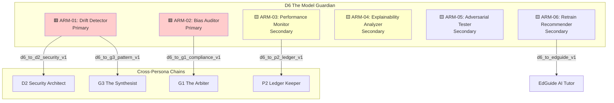
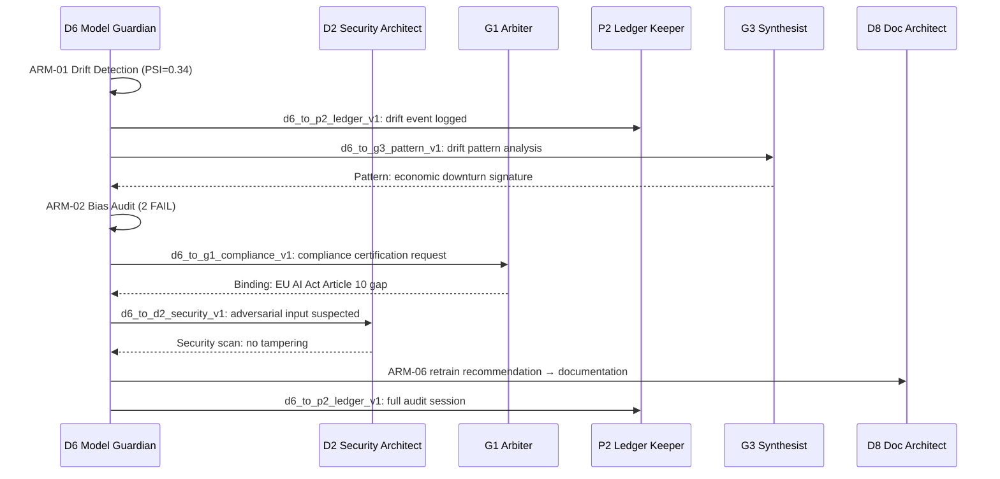

# AGENTIC_ARMS_OVERVIEW.md
## Persona D6 — The Model Guardian | Agentic Arm Architecture

**Version:** 1.0.0  
**Status:** Production-ready  
**Date:** 2026-06-28  
**Owner:** D6 The Model Guardian  
**Parent Strategy:** `C:\KimiWork Projects\GAI-OBSERVE-DESIGN\skills-hooks-plugins-strategy\STRATEGY.md`  
**Persona Definition:** `C:\KimiWork Projects\CORPORATE V 0.5\PERSONA_D6_The_Model_Guardian.md`

---

## 1. Executive Summary

The Model Guardian (D6) is the **AI conscience** of the GAI-OBSERVE advisory system. Its Agentic Arm Architecture defines how D6 monitors, audits, explains, and safeguards AI/ML models across the ecosystem. Where other personas watch systems and code, D6 watches the models themselves — detecting drift, auditing bias, tracking performance, and ensuring ethical compliance.

This document defines the complete arm topology, invocation semantics, cross-persona chaining, and operational contracts for all D6 agentic capabilities.

---

## 2. Agentic Arm Architecture



---

## 3. Primary Arms (2–3)

### ARM-01: Drift Detector
- **ID:** `drift_detector`
- **Purpose:** Continuous monitoring of data drift, concept drift, feature drift, and label drift
- **Statistical Tests:** KS, PSI, Chi-Square, Wasserstein, Earth Mover's Distance
- **Trigger:** Scheduled (cron), on-demand (API), event-driven (deployment)
- **Output:** Drift report JSON, drift magnitude score, feature-level breakdown, impact assessment, visualization PNG
- **Critical Gate:** `R-ARM-MM-1` — Drift test matches statistical reference
- **Chains to:** D2 (security hardening if drift indicates adversarial input), G3 (pattern synthesis if drift is systematic), P2 (ledger event)

### ARM-02: Bias Auditor
- **ID:** `bias_auditor`
- **Purpose:** Fairness auditing across protected attributes (gender, race, age, disability, religion, national origin)
- **Metrics:** Demographic parity, equalized odds, equal opportunity, calibration, predictive parity, disparate impact ratio
- **Trigger:** Scheduled (quarterly), on-demand (pre-deployment), event-driven (regulatory request)
- **Output:** Bias audit report, fairness scorecard, subgroup performance breakdown, regulatory compliance mapping (EU AI Act, NYC 144, EEOC)
- **Critical Gate:** `R-ARM-MM-2` — Bias audit covers protected attributes
- **Chains to:** G1 (compliance certification), P2 (ledger event), D2 (if bias indicates data leakage or tampering)

### ARM-03: Performance Monitor *(Primary in practice, Secondary in taxonomy)*
- **ID:** `performance_monitor`
- **Purpose:** Real-time model performance tracking (accuracy, precision, recall, F1, AUC, log-loss, calibration)
- **Trigger:** Real-time (streaming), scheduled (hourly), on-demand (health check)
- **Output:** Performance dashboard JSON, SLA compliance score, model health score, confidence distribution, trend analysis
- **Critical Gate:** `R-ARM-MM-4` — Threshold breaches ledgered
- **Chains to:** P2 (ledger), D5 (SRE alerting), D1 (SPC control charts)

---

## 4. Secondary Arms (2–3)

### ARM-04: Explainability Analyzer
- **ID:** `explainability_analyzer`
- **Purpose:** Model explainability, feature importance, SHAP/LIME analysis, counterfactual generation
- **Trigger:** On-demand (prediction explanation), scheduled (monthly explainability audit), event-driven (regulatory request)
- **Output:** Explainability report, SHAP waterfall plot, LIME local explanation, counterfactual examples, GDPR Article 22 compliance verdict
- **Chains to:** D8 (documentation generation), G1 (regulatory compliance), D2 (adversarial input explanation)

### ARM-05: Adversarial Tester
- **ID:** `adversarial_tester`
- **Purpose:** Adversarial robustness testing (FGSM, PGD, Carlini-Wagner, boundary attacks)
- **Trigger:** On-demand (security assessment), scheduled (quarterly), event-driven (G2 Red Team request)
- **Output:** Adversarial robustness report, vulnerability score, perturbation analysis, remediation recommendations
- **Chains to:** D2 (security hardening), G2 (Red Team coordination), P2 (ledger event)

### ARM-06: Retrain Recommender
- **ID:** `retrain_recommender`
- **Purpose:** Data-driven retrain triggers with explainable rationale, validation gates, and cost estimation
- **Trigger:** Event-driven (drift + performance degradation + bias fail), scheduled (monthly review), on-demand (what-if analysis)
- **Output:** Retrain recommendation JSON, expected improvement metrics, validation gate criteria, cost estimate, risk assessment
- **Critical Gate:** `R-ARM-MM-3` — Retrain trigger is explainable
- **Chains to:** D9 (Forward Engineer — pipeline generation), D3 (Delivery Captain — scheduling), G1 (compliance approval)

---

## 5. Arm Composition: Cross-Persona Chaining



---

## 6. Arm Invocation Semantics

### 6.1 Invocation Pattern

Every D6 arm follows the same invocation contract:

```yaml
arm_invocation:
  trigger:
    type: enum [scheduled, on_demand, event_driven, chained]
    scheduled:
      cron: "0 */6 * * *"  # Every 6 hours
      timezone: "UTC"
    on_demand:
      endpoint: "/v1/ai/{arm_id}/invoke"
      method: "POST"
    event_driven:
      source: ["model_deployed", "drift_alert", "bias_request", "regulatory_audit"]
      queue: "d6-events"
    chained:
      from_persona: [D2, G1, P2, G3, D5, D1, D8]
      hook_contract: "d6_to_*_v1"
  input:
    model_id: "string (UUID)"
    model_version: "string (semver)"
    artifact_uri: "string (S3/MinIO path)"
    reference_data: "string (baseline dataset ID)"
    current_data: "string (production dataset ID)"
    protected_attributes: ["gender", "race", "age"]
    thresholds: "object (per-metric thresholds)"
  output:
    arm_id: "string"
    status: "enum [pass, warn, fail, error]"
    confidence: "float [0.0-1.0]"
    deliverable_uri: "string (artifact path)"
    ledger_hash: "string (P2 reference)"
    next_arms: ["arm_id or persona_id"]
  timeout:
    default_ms: 300000  # 5 minutes
    max_ms: 1800000    # 30 minutes (bias audit)
  retry:
    policy: "exponential_backoff"
    max_attempts: 3
    backoff_base_ms: 1000
  fallback:
    on_timeout: "return_partial_results_with_warn_status"
    on_error: "log_to_ledger_and_alert_d5"
    on_unavailable: "queue_for_retry_and_notify_d3"
```

### 6.2 Arm Registry Table

| Arm ID | Name | Type | Trigger | Timeout | Retry | Fallback | Cross-Chain |
|--------|------|------|---------|---------|-------|----------|-------------|
| `ARM-01` | Drift Detector | Primary | Scheduled / On-demand / Event | 5 min | 3x exp backoff | Partial + alert | D2, G3, P2 |
| `ARM-02` | Bias Auditor | Primary | Scheduled / On-demand / Event | 30 min | 3x exp backoff | Partial + alert | G1, P2, D2 |
| `ARM-03` | Performance Monitor | Secondary | Real-time / Scheduled / On-demand | 2 min | 3x exp backoff | Cached baseline | P2, D5, D1 |
| `ARM-04` | Explainability Analyzer | Secondary | On-demand / Scheduled | 10 min | 3x exp backoff | Feature importance only | D8, G1, D2 |
| `ARM-05` | Adversarial Tester | Secondary | On-demand / Scheduled | 20 min | 3x exp backoff | Skip + alert | D2, G2, P2 |
| `ARM-06` | Retrain Recommender | Secondary | Event-driven / On-demand | 5 min | 3x exp backoff | Manual review flag | D9, D3, G1 |

---

## 7. Operational Standards

- **FastAPI:** All arm endpoints served via FastAPI routers with Pydantic v2 schemas
- **PostgreSQL:** All structured results stored in PostgreSQL 15 with JSONB columns
- **Redis:** Active session cache, job queue, and metric buffer
- **JWT:** RS256 token-based auth with role-based access (`d6-monitor`, `d6-audit`, `d6-admin`)
- **Pydantic v2:** All input/output schemas use `BaseModel` with `EmailStr`, `UUID`, `Field` validators
- **Ports:** Dev 9000, Redis 6380, PostgreSQL 5433
- **Health:** `/health` and `/metrics` endpoints on every arm service
- **Testing:** Sync tests (TestClient) and async tests (AsyncClient) in separate pytest sessions
- **Compliance:** Reserved column name scan, JSONB pattern check, JWT library check (PyJWT only)

---

## 8. References

- `STRATEGY.md` — `C:\KimiWork Projects\GAI-OBSERVE-DESIGN\skills-hooks-plugins-strategy\STRATEGY.md`
- `PERSONA_D6_The_Model_Guardian.md` — `C:\KimiWork Projects\CORPORATE V 0.5\PERSONA_D6_The_Model_Guardian.md`
- `INITIATIVE_08_KNOWLEDGEENGINE_AUGMENTATION.md` — `C:\KimiWork Projects\GAI-OBSERVE-DESIGN\skills-hooks-plugins-strategy\INITIATIVE_08_KNOWLEDGEENGINE_AUGMENTATION.md`
- `ALPHA_CLAUDE_AUGMENTATION.md` — `C:\KimiWork Projects\GAI-OBSERVE-DESIGN\skills-hooks-plugins-strategy\ALPHA_CLAUDE_AUGMENTATION.md`
- `architecture.md` — `C:\KimiWork Projects\GAI-OBSERVE-DESIGN\architecture.md`

---

**Document Owner:** GAI-OBSERVE Advisory Architecture Team  
**Next Review:** 2026-07-28  
**Classification:** Internal — Architecture
