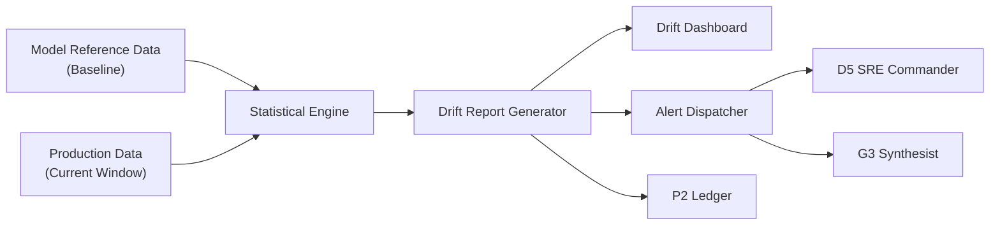

# ARM_01_D6_Drift_Detector.md
## Persona D6 — The Model Guardian | Primary Arm 1: Drift Detector

**Arm ID:** `ARM-01`  
**Name:** `drift_detector`  
**Type:** Primary  
**Status:** Production-ready  
**Version:** 1.0.0  
**Owner:** D6 The Model Guardian  
**Parent:** `AGENTIC_ARMS_OVERVIEW.md`

---

## 1. Purpose

The Drift Detector arm monitors AI/ML models for **four types of drift** with statistical rigor:

| Drift Type | Description | Statistical Test | Severity Threshold |
|------------|-------------|------------------|-------------------|
| **Data Drift** | Input feature distribution changes vs. training | PSI, KS, Wasserstein | PSI > 0.25 = SIGNIFICANT |
| **Concept Drift** | Relationship between features and target changes | Chi-Square, Cramer's V | p < 0.01 = SIGNIFICANT |
| **Feature Drift** | Individual feature distribution shifts | PSI per-feature, KS per-feature | PSI > 0.20 = SIGNIFICANT |
| **Label Drift** | Target variable distribution changes | PSI (label), Chi-Square (label) | PSI > 0.20 = SIGNIFICANT |

---

## 2. Architecture



---

## 3. Statistical Test Matrix

```yaml
drift_tests:
  population_stability_index:
    name: "PSI"
    description: "Measures distribution shift between reference and current"
    formula: "sum((Actual% - Expected%) * ln(Actual% / Expected%))"
    thresholds:
      low: "< 0.1"
      moderate: "0.1 - 0.25"
      significant: "> 0.25"
    applicable: [data_drift, feature_drift, label_drift]

  kolmogorov_smirnov:
    name: "KS Test"
    description: "Two-sample test for continuous distributions"
    statistic: "D = sup|F1(x) - F2(x)|"
    thresholds:
      p_value: "< 0.05 indicates drift"
    applicable: [data_drift, feature_drift]

  chi_square:
    name: "Chi-Square Test"
    description: "Tests independence for categorical features"
    statistic: "sum((O - E)^2 / E)"
    thresholds:
      p_value: "< 0.01 indicates significant drift"
    applicable: [concept_drift, label_drift, categorical_feature_drift]

  wasserstein_distance:
    name: "Wasserstein Distance"
    description: "Earth Mover's Distance — intuitive drift magnitude"
    formula: "inf integral |F1(x) - F2(x)| dx"
    thresholds:
      normalized: "> 0.15 indicates drift"
    applicable: [data_drift, feature_drift]
```

---

## 4. Drift Report Schema

```json
{
  "report_id": "drift-uuid-v4",
  "model_id": "model-123",
  "model_version": "2.3.1",
  "arm_id": "ARM-01",
  "timestamp": "2026-06-28T14:00:00Z",
  "reference_period": "2025-10-15/2026-01-15",
  "current_period": "2026-04-15/2026-06-28",
  "overall_status": "SIGNIFICANT",
  "overall_psi": 0.34,
  "tests": {
    "psi": { "status": "SIGNIFICANT", "value": 0.34, "threshold": 0.25 },
    "ks": { "status": "SIGNIFICANT", "p_value": 0.001, "d_statistic": 0.42 },
    "wasserstein": { "status": "MODERATE", "distance": 0.18, "normalized": 0.22 }
  },
  "feature_breakdown": [
    {
      "feature": "credit_score",
      "psi": 0.21,
      "status": "SIGNIFICANT",
      "ks_p_value": 0.002,
      "wasserstein": 0.19,
      "reference_mean": 720,
      "current_mean": 697,
      "reference_std": 85,
      "current_std": 92
    },
    {
      "feature": "income",
      "psi": 0.12,
      "status": "MODERATE",
      "ks_p_value": 0.04,
      "wasserstein": 0.08,
      "reference_mean": 65000,
      "current_mean": 58000
    },
    {
      "feature": "age",
      "psi": 0.08,
      "status": "LOW",
      "ks_p_value": 0.12,
      "wasserstein": 0.04
    }
  ],
  "impact_assessment": {
    "accuracy_drop": 0.07,
    "precision_drop": 0.09,
    "recall_drop": 0.04,
    "root_cause": "Economic downturn (2026 Q1-Q2) reduced average credit scores by 23 points and increased income volatility",
    "recommended_action": "RETRAIN with post-downturn data",
    "confidence": 0.91
  },
  "visualization_uris": [
    "s3://d6-reports/drift-uuid/drift_distribution.png",
    "s3://d6-reports/drift-uuid/feature_psi_bars.png",
    "s3://d6-reports/drift-uuid/ks_qq_plots.png"
  ]
}
```

---

## 5. Alert Dispatch

| Severity | Condition | Recipients | Channels | SLA |
|----------|-----------|------------|----------|-----|
| **CRITICAL** | PSI > 0.35 or accuracy drop > 10% | D6, D5, D3, G1 | Slack, PagerDuty, Email | 5 min |
| **SIGNIFICANT** | PSI > 0.25 or accuracy drop > 5% | D6, D5 | Slack, Email | 15 min |
| **MODERATE** | PSI > 0.10 or accuracy drop > 2% | D6 | Email, Dashboard | 1 hour |
| **LOW** | PSI > 0.05 | D6 | Dashboard only | 24 hours |

---

## 6. Invocation Contract

```yaml
arm:
  id: "ARM-01"
  name: "drift_detector"
  trigger:
    - type: "scheduled"
      cron: "0 */6 * * *"
      description: "Every 6 hours for all active models"
    - type: "on_demand"
      endpoint: "/v1/ai/drift/{model_id}"
      method: "POST"
    - type: "event_driven"
      event: "model_deployed"
      queue: "d6-events"
    - type: "chained"
      hook: "d6_to_g3_pattern_v1"
      description: "After drift detected, trigger pattern synthesis"

  input:
    schema: "DriftDetectRequest"
    fields:
      model_id: "UUID"
      model_version: "string (semver)"
      reference_data_uri: "string (S3/MinIO)"
      current_data_uri: "string (S3/MinIO)"
      features: "array[string]"
      thresholds: "object (optional, overrides defaults)"
      test_suite: "array[enum] (optional: psi, ks, chi_square, wasserstein)"

  output:
    schema: "DriftDetectResponse"
    fields:
      report_id: "UUID"
      status: "enum [pass, warn, fail, error]"
      overall_psi: "float"
      feature_breakdown: "array[FeatureDrift]"
      impact_assessment: "ImpactAssessment"
      visualization_uris: "array[string]"
      ledger_hash: "string (P2 reference)"
      next_arm: "ARM-06 (retrain_recommender) if fail"

  timeout:
    default_ms: 300000
    max_ms: 600000

  retry:
    policy: "exponential_backoff"
    max_attempts: 3
    base_ms: 1000

  fallback:
    on_timeout: "return cached baseline with warn status"
    on_error: "log to P2 and alert D5"
```

---

## 7. Performance Characteristics

| Metric | Target | Measurement |
|--------|--------|-------------|
| Throughput | 50 models / hour | Prometheus counter |
| Latency P50 | < 30s | Prometheus histogram |
| Latency P99 | < 5 min | Prometheus histogram |
| Memory | < 4 GB per model | Container metrics |
| Storage | < 100 MB per report | S3 object size |

---

## 8. Tool Bindings

| Tool ID | Tool Name | Role in Arm | Execution Mode |
|---------|-----------|-------------|---------------|
| `T-01` | `drift_calculator` | Core statistical engine | Python/CPU |
| `T-02` | `statistical_tester` | Test orchestration (KS, PSI, etc.) | Python/CPU |
| `T-13` | `model_lineage_tracker` | Baseline retrieval and version mapping | FastAPI/DB |
| `T-15` | `dataset_profiler` | Data quality pre-check before drift test | Python/CPU |

---

**Document Owner:** GAI-OBSERVE Advisory Architecture Team  
**Next Review:** 2026-07-28  
**Classification:** Internal — Arm Specification
