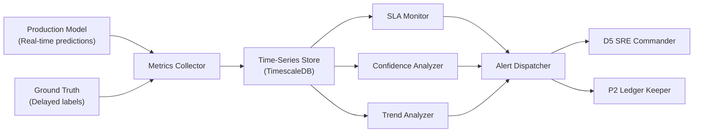

# ARM_03_D6_Performance_Monitor.md
## Persona D6 — The Model Guardian | Secondary Arm 3: Performance Monitor

**Arm ID:** `ARM-03`  
**Name:** `performance_monitor`  
**Type:** Secondary  
**Status:** Production-ready  
**Version:** 1.0.0  
**Owner:** D6 The Model Guardian  
**Parent:** `AGENTIC_ARMS_OVERVIEW.md`

---

## 1. Purpose

The Performance Monitor arm tracks **real-time model performance** across classification, regression, and probabilistic metrics. It detects performance degradation, prediction confidence erosion, and SLA violations with automated alerting.

---

## 2. Metric Taxonomy

### Classification Metrics

| Metric | Formula | Healthy Range | Degradation Threshold | Arm Action |
|--------|---------|---------------|----------------------|------------|
| **Accuracy** | (TP + TN) / (TP + TN + FP + FN) | > 0.85 | Drop > 5% | Alert D5 |
| **Precision** | TP / (TP + FP) | > 0.80 | Drop > 5% | Alert D5 |
| **Recall** | TP / (TP + FN) | > 0.85 | Drop > 5% | Alert D5 |
| **F1 Score** | 2 * (Precision * Recall) / (Precision + Recall) | > 0.82 | Drop > 5% | Alert D5 |
| **AUC-ROC** | Area under ROC curve | > 0.85 | Drop > 0.05 | Alert D5 + D3 |
| **Log Loss** | -1/N * sum(y*log(p) + (1-y)*log(1-p)) | < 0.30 | Increase > 20% | Alert D5 |
| **Balanced Accuracy** | (Sensitivity + Specificity) / 2 | > 0.80 | Drop > 5% | Alert D5 |

### Regression Metrics

| Metric | Formula | Healthy Range | Degradation Threshold | Arm Action |
|--------|---------|---------------|----------------------|------------|
| **MAE** | mean(\|y - ŷ\|) | < 10% of target range | Increase > 15% | Alert D5 |
| **RMSE** | sqrt(mean((y - ŷ)^2)) | < 15% of target range | Increase > 15% | Alert D5 |
| **R²** | 1 - (SS_res / SS_tot) | > 0.70 | Drop > 0.10 | Alert D5 + D3 |
| **MAPE** | mean(\|y - ŷ\| / y) * 100 | < 10% | Increase > 20% | Alert D5 |

### Calibration Metrics

| Metric | Formula | Healthy Range | Degradation Threshold | Arm Action |
|--------|---------|---------------|----------------------|------------|
| **Brier Score** | mean((p - y)^2) | < 0.15 | Increase > 0.05 | Alert D5 + D1 |
| **Expected Calibration Error (ECE)** | sum_k (n_k/N) * \|acc_k - conf_k\| | < 0.05 | Increase > 0.02 | Alert D5 |
| **Reliability Diagram** | binned accuracy vs. confidence | Linear | Non-linear | Alert D5 |

---

## 3. Architecture



---

## 4. Performance Dashboard Schema

```json
{
  "dashboard_id": "perf-uuid-v4",
  "model_id": "model-123",
  "model_version": "2.3.1",
  "arm_id": "ARM-03",
  "timestamp": "2026-06-28T14:00:00Z",
  "window": "last_24h",
  "overall_health": "DEGRADED",
  "health_score": 0.72,
  "metrics": {
    "accuracy": {
      "current": 0.82,
      "baseline": 0.89,
      "delta": -0.07,
      "trend": "declining",
      "status": "FAIL"
    },
    "precision": {
      "current": 0.76,
      "baseline": 0.85,
      "delta": -0.09,
      "trend": "declining",
      "status": "FAIL"
    },
    "recall": {
      "current": 0.88,
      "baseline": 0.92,
      "delta": -0.04,
      "trend": "stable",
      "status": "PASS"
    },
    "f1": {
      "current": 0.82,
      "baseline": 0.88,
      "delta": -0.06,
      "trend": "declining",
      "status": "FAIL"
    },
    "auc": {
      "current": 0.84,
      "baseline": 0.90,
      "delta": -0.06,
      "trend": "declining",
      "status": "MARGINAL"
    },
    "brier_score": {
      "current": 0.21,
      "baseline": 0.12,
      "delta": 0.09,
      "trend": "worsening",
      "status": "FAIL"
    }
  },
  "confidence_distribution": {
    "mean_confidence": 0.74,
    "median_confidence": 0.78,
    "std_confidence": 0.18,
    "high_confidence_ratio": 0.45,
    "low_confidence_ratio": 0.28,
    "confidence_erosion": true
  },
  "sla_compliance": {
    "latency_p50_ms": 45,
    "latency_p99_ms": 180,
    "availability_24h": 0.9992,
    "error_rate": 0.0008,
    "sla_target": 0.999,
    "status": "PASS"
  },
  "trend_analysis": {
    "direction": "declining",
    "rate_per_week": -0.02,
    "projected_breach_date": "2026-07-15",
    "recommended_action": "RETRAIN within 2 weeks"
  }
}
```

---

## 5. Confidence Erosion Detection

The arm monitors prediction confidence distributions for **confidence erosion** — a leading indicator of model staleness:

```python
# Confidence erosion algorithm
class ConfidenceErosionDetector:
    def detect(self, current_dist, baseline_dist):
        # 1. Compare mean confidence
        mean_drop = baseline_dist.mean - current_dist.mean
        
        # 2. Compare high-confidence prediction ratio
        high_conf_baseline = baseline_dist.pct_above(0.9)
        high_conf_current = current_dist.pct_above(0.9)
        high_conf_drop = high_conf_baseline - high_conf_current
        
        # 3. Compare distribution entropy
        entropy_increase = current_dist.entropy - baseline_dist.entropy
        
        erosion_score = (
            0.4 * mean_drop + 
            0.4 * high_conf_drop + 
            0.2 * entropy_increase
        )
        
        return {
            "erosion_detected": erosion_score > 0.15,
            "erosion_score": erosion_score,
            "severity": "HIGH" if erosion_score > 0.30 else "MEDIUM" if erosion_score > 0.15 else "LOW"
        }
```

---

## 6. SLA Tracking

| SLA Metric | Target | Measurement Window | Escalation Path |
|------------|--------|-------------------|-----------------|
| **Latency P50** | < 50 ms | Rolling 1 hour | D5 (SRE) |
| **Latency P99** | < 200 ms | Rolling 1 hour | D5 (SRE) |
| **Availability** | > 99.9% | Rolling 24 hours | D5 (SRE) + D3 (Delivery) |
| **Error Rate** | < 0.1% | Rolling 1 hour | D5 (SRE) + D2 (Security) |
| **Prediction Throughput** | > 1000/sec | Rolling 1 minute | D5 (SRE) |

---

## 7. Invocation Contract

```yaml
arm:
  id: "ARM-03"
  name: "performance_monitor"
  trigger:
    - type: "real_time"
      interval_ms: 60000
      description: "Metrics computed every 60 seconds from streaming predictions"
    - type: "scheduled"
      cron: "0 * * * *"
      description: "Hourly aggregation and health score update"
    - type: "on_demand"
      endpoint: "/v1/ai/performance/{model_id}"
      method: "GET"

  input:
    schema: "PerformanceMonitorRequest"
    fields:
      model_id: "UUID"
      model_version: "string (semver)"
      prediction_stream: "string (Kafka topic)"
      ground_truth_stream: "string (Kafka topic, optional)"
      metric_suite: "array[enum] (default: all)"
      window: "enum [1h, 24h, 7d, 30d]"
      baseline_period: "string (date range)"

  output:
    schema: "PerformanceMonitorResponse"
    fields:
      dashboard_id: "UUID"
      overall_health: "enum [healthy, degraded, critical, error]"
      health_score: "float [0.0-1.0]"
      metrics: "object (per-metric current/baseline/delta)"
      confidence_distribution: "ConfidenceDistribution"
      sla_compliance: "SLACompliance"
      trend_analysis: "TrendAnalysis"
      ledger_hash: "string (P2 reference)"
      next_arm: "ARM-01 (drift_detector) if degraded"

  timeout:
    default_ms: 120000
    max_ms: 300000

  retry:
    policy: "exponential_backoff"
    max_attempts: 3
    base_ms: 500

  fallback:
    on_timeout: "return cached metrics from last successful run"
    on_error: "log to P2 and alert D5 immediately"
```

---

## 8. Tool Bindings

| Tool ID | Tool Name | Role in Arm | Execution Mode |
|---------|-----------|-------------|---------------|
| `T-05` | `performance_tracker` | Core metric calculation | Python/CPU |
| `T-06` | `sla_monitor` | SLA compliance tracking | FastAPI/DB |
| `T-13` | `model_lineage_tracker` | Baseline retrieval | FastAPI/DB |
| `T-14` | `experiment_logger` | Time-series logging | TimescaleDB |

---

**Document Owner:** GAI-OBSERVE Advisory Architecture Team  
**Next Review:** 2026-07-28  
**Classification:** Internal — Arm Specification