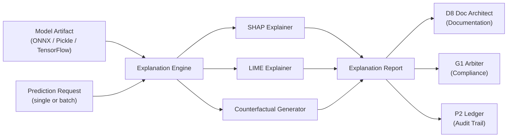
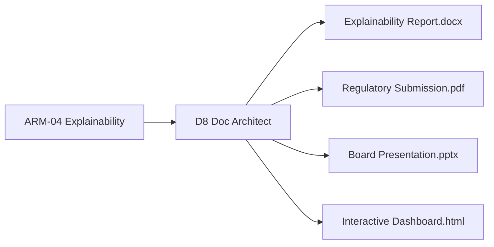

# ARM_04_D6_Explainability_Analyzer.md
## Persona D6 — The Model Guardian | Secondary Arm 4: Explainability Analyzer

**Arm ID:** `ARM-04`  
**Name:** `explainability_analyzer`  
**Type:** Secondary  
**Status:** Production-ready  
**Version:** 1.0.0  
**Owner:** D6 The Model Guardian  
**Parent:** `AGENTIC_ARMS_OVERVIEW.md`

---

## 1. Purpose

The Explainability Analyzer arm generates **model explanations** that satisfy regulatory requirements (GDPR Article 22) and operational debugging needs. It produces feature importance, SHAP values, LIME local explanations, and counterfactual analysis.

---

## 2. Explanation Methods

```yaml
explanation_methods:
  global_feature_importance:
    name: "Global Feature Importance"
    description: "Aggregated feature importance across all predictions"
    techniques: ["permutation_importance", "gain_importance", "split_importance"]
    output: "ranked feature list with importance scores"
    regulatory_mapping: "GDPR Article 22 — right to explanation"

  shap_values:
    name: "SHAP (SHapley Additive exPlanations)"
    description: "Game-theoretic feature attribution for each prediction"
    techniques: ["TreeSHAP", "KernelSHAP", "DeepSHAP"]
    output: "SHAP values per feature per prediction, waterfall plot, summary plot"
    regulatory_mapping: "GDPR Article 22 — individual decision explanation"
    supported_models: ["tree_based", "neural_networks", "linear", "any (kernel)"]

  lime_explanations:
    name: "LIME (Local Interpretable Model-agnostic Explanations)"
    description: "Local surrogate model explanation around a single prediction"
    techniques: ["tabular_lime", "text_lime", "image_lime"]
    output: "local feature weights, perturbation analysis, interpretable surrogate"
    regulatory_mapping: "GDPR Article 22 — local explanation for individual"
    supported_models: ["any_model_agnostic"]

  counterfactual_analysis:
    name: "Counterfactual Explanations"
    description: "What changes would flip the prediction?"
    techniques: ["dice_ml", "actionable_recourse", "nearest_counterfactual"]
    output: "counterfactual instances, feature changes required, feasibility score"
    regulatory_mapping: "GDPR Article 22 — actionable explanation"
```

---

## 3. Architecture



---

## 4. Explainability Report Schema

```json
{
  "report_id": "expl-uuid-v4",
  "model_id": "model-123",
  "model_version": "2.3.1",
  "arm_id": "ARM-04",
  "timestamp": "2026-06-28T14:00:00Z",
  "gdpr_compliance": {
    "article_22_status": "COMPLIANT",
    "explanation_type": "meaningful_information_about_logic_involved",
    "human_review_available": true,
    "automated_decision": true,
    "explanation_scope": "individual_and_general"
  },
  "global_feature_importance": [
    {
      "feature": "credit_score",
      "importance": 0.34,
      "rank": 1,
      "method": "shap_mean_abs",
      "description": "Credit score is the strongest predictor of loan approval"
    },
    {
      "feature": "income",
      "importance": 0.28,
      "rank": 2,
      "method": "shap_mean_abs",
      "description": "Annual income is the second strongest predictor"
    },
    {
      "feature": "employment_history",
      "importance": 0.15,
      "rank": 3,
      "method": "shap_mean_abs"
    },
    {
      "feature": "zip_code",
      "importance": 0.08,
      "rank": 4,
      "method": "shap_mean_abs",
      "warning": "Potential proxy for race — review for fairness"
    }
  ],
  "shap_analysis": {
    "summary_plot_uri": "s3://d6-reports/expl-uuid/shap_summary.png",
    "waterfall_plot_uri": "s3://d6-reports/expl-uuid/shap_waterfall.png",
    "beeswarm_plot_uri": "s3://d6-reports/expl-uuid/shap_beeswarm.png",
    "top_features": ["credit_score", "income", "employment_history"]
  },
  "lime_explanations": [
    {
      "prediction_id": "pred-456",
      "prediction": 0,
      "confidence": 0.34,
      "local_explanation": [
        {"feature": "credit_score", "weight": -0.42, "value": 580},
        {"feature": "income", "weight": -0.18, "value": 42000},
        {"feature": "employment_history", "weight": 0.08, "value": 5}
      ],
      "plot_uri": "s3://d6-reports/expl-uuid/lime_pred_456.png"
    }
  ],
  "counterfactuals": [
    {
      "original_prediction": 0,
      "counterfactual_prediction": 1,
      "changes_required": [
        {"feature": "credit_score", "original": 580, "required": 640, "diff": 60},
        {"feature": "income", "original": 42000, "required": 48000, "diff": 6000}
      ],
      "feasibility_score": 0.72,
      "distance": 0.18
    }
  ],
  "regulatory_verdict": {
    "gdpr_article_22": "COMPLIANT",
    "explanation_quality": "HIGH",
    "actionable": true,
    "human_readable": true,
    "recommendation": "Explanation package sufficient for regulatory disclosure"
  }
}
```

---

## 5. GDPR Article 22 Compliance Mapping

| Requirement | Arm Capability | Evidence |
|-------------|--------------|----------|
| **Right to explanation** | SHAP + LIME per prediction | Waterfall plots, local feature weights |
| **Meaningful info about logic** | Global feature importance | Ranked feature list with descriptions |
| **Human review** | Counterfactual analysis | Actionable changes required to flip decision |
| **Automated decision disclosed** | Report metadata | `automated_decision: true` flag |
| **Right to contest** | Confidence + counterfactual | Feasibility score + distance metric |

---

## 6. Interactive Visualization Spec

The arm generates **interactive explainability dashboards** with:

```yaml
visualizations:
  shap_summary_plot:
    type: "beeswarm"
    x_axis: "SHAP value (impact on prediction)"
    y_axis: "Feature (sorted by importance)"
    color: "Feature value (red=high, blue=low)"
    interactivity: ["hover_for_details", "zoom", "filter_by_feature"]

  shap_waterfall_plot:
    type: "waterfall"
    base_value: "E[f(X)] = model average prediction"
    contributions: "Per-feature SHAP value pushing prediction up/down"
    final_value: "f(x) = current prediction"
    interactivity: ["hover_for_value", "toggle_features"]

  lime_local_plot:
    type: "bar"
    x_axis: "Local feature weight"
    y_axis: "Feature"
    color: "Direction (green=pro, red=con)"
    interactivity: ["hover_for_value", "show_perturbation"]

  counterfactual_table:
    type: "interactive_table"
    columns: ["Feature", "Original", "Required", "Difference", "Feasibility"]
    actions: ["export_csv", "export_pdf", "share_with_d8"]
```

---

## 7. Invocation Contract

```yaml
arm:
  id: "ARM-04"
  name: "explainability_analyzer"
  trigger:
    - type: "on_demand"
      endpoint: "/v1/ai/explain/{model_id}"
      method: "POST"
      description: "Explain single prediction or full model"
    - type: "scheduled"
      cron: "0 0 1 * *"
      description: "Monthly explainability audit for all regulated models"
    - type: "event_driven"
      event: "regulatory_request"
      queue: "d6-compliance"

  input:
    schema: "ExplainabilityRequest"
    fields:
      model_id: "UUID"
      model_version: "string (semver)"
      explanation_type: "enum [global, local, counterfactual, all]"
      prediction_id: "UUID (optional, for local explanation)"
      prediction_data: "object (optional, for local explanation)"
      methods: "array[enum] (default: [shap, lime, counterfactual])"
      regulatory_framework: "enum [GDPR, CCPA, EU_AI_ACT, none]"
      output_format: "enum [json, pdf, html, interactive]"

  output:
    schema: "ExplainabilityResponse"
    fields:
      report_id: "UUID"
      gdpr_compliance: "GDPRCompliance"
      global_feature_importance: "array[FeatureImportance]"
      shap_analysis: "SHAPAnalysis"
      lime_explanations: "array[LIMEExplanation]"
      counterfactuals: "array[Counterfactual]"
      regulatory_verdict: "RegulatoryVerdict"
      visualization_uris: "array[string]"
      ledger_hash: "string (P2 reference)"
      next_arm: "ARM-02 (bias_auditor) if proxy detected"

  timeout:
    default_ms: 600000
    max_ms: 1200000

  retry:
    policy: "exponential_backoff"
    max_attempts: 3
    base_ms: 2000

  fallback:
    on_timeout: "return global feature importance only with warn status"
    on_error: "log to P2 and alert D5"
```

---

## 8. Tool Bindings

| Tool ID | Tool Name | Role in Arm | Execution Mode |
|---------|-----------|-------------|---------------|
| `T-07` | `shap_explainer` | SHAP value computation | Python/CPU (GPU optional) |
| `T-08` | `lime_explainer` | LIME local explanation | Python/CPU |
| `T-09` | `counterfactual_generator` | Counterfactual generation | Python/CPU |
| `T-15` | `dataset_profiler` | Feature metadata and ranges | Python/CPU |

---

## 9. D8 Integration

The Explainability Analyzer arm interfaces with **D8 The Doc Architect** for:
- Explainability report generation (`docx`, `pdf`, `md-to-pdf`)
- Interactive dashboard embedding (`pptx`, `theme-factory`)
- Architecture diagram generation (C4 models for explanation pipelines)
- Whitepaper documentation for regulatory submission



---

**Document Owner:** GAI-OBSERVE Advisory Architecture Team  
**Next Review:** 2026-07-28  
**Classification:** Internal — Arm Specification